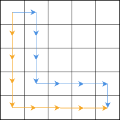
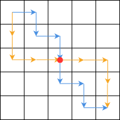

- [QualのWrite](../07)
- [R1AのWriteUp](../13)
- [R1BのWriteUp](../29)

# 結果
AB2完41ptで通過した．CDも解くつもりでいたが，Cで多倍長整数が必要なことに気付いてやる気を無くした．Round1以降に多倍長が出たらこの人はどうするつもりなのだろうか．

# A: Foregone Solution
## 概略
正整数 $N$ が渡されるので $N=A+B$ となるように分割する．ただし $A,B$ は正整数で $4$ を含んではならない．

$N$ には1つ以上 $4$ が含まれる．

## 雑感
読みやすくて助かる．桁ごとに見て，$4$ を $2+2$ に分解すればよさそう．この出力形式誰が得するんだ．



# B: You Can Go Your Own Way
## 概略
正方形のグリッドを左上から右下に動く人がいる．この人と経路を共有しないように左上から右下に向かうにはどう動けばいいか．

## 雑感
即座に反転が思いついたがなぜか解法から外してしまった．まったく意味がわからない．結局場合分けをして解いた．結構重くなってしまった．

- 左上から出る向きと右下に入る向きが違うとき

図のように端を通る．

- 左上から出る向きと右下に入る向きが同じとき

鳩の巣原理から，同一方向に2連続で動くことがあるので，そこを狙って1回だけ交わる．図だと赤点を狙い撃ちしている．



# 感想
通過するだけなら意外と簡単だった．「*Google Code Jam 2019 - Qualification Round通過* 」って字面だけ見たら激強に見えるな．Googleすごい．実際に強いと言えるのはTシャツを貰ってからだと思っているので，そこまでは頑張りたい．調べたら残りの参加者は27610人らしい．1000/27610…
