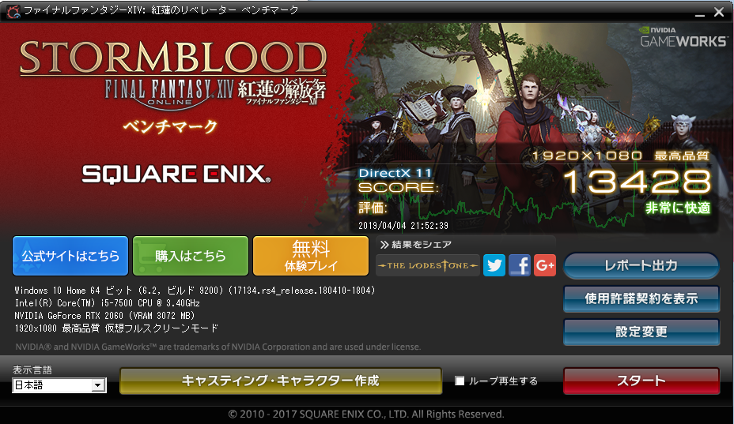
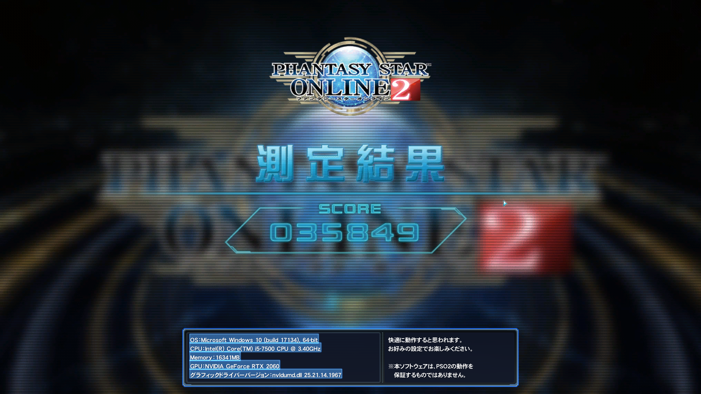

## 環境

## DQX
- グラフィック設定: 最高品質
- 解像度: 1920×1080
- 表示方法: 仮想フルスクリーン
- スコア: 18417
- 評価: すごく快適

## BIOHAZARD6
- 解像度: 1920×1080
- スコア: 23446
- 評価: S

## FFXIV紅蓮
VRAM 3072MB ←???

## FFXIV
快適な割に全動作でヒットストップみたいなのがかかってて冷えた

## PSO2

[^1]: 12.5インチ
